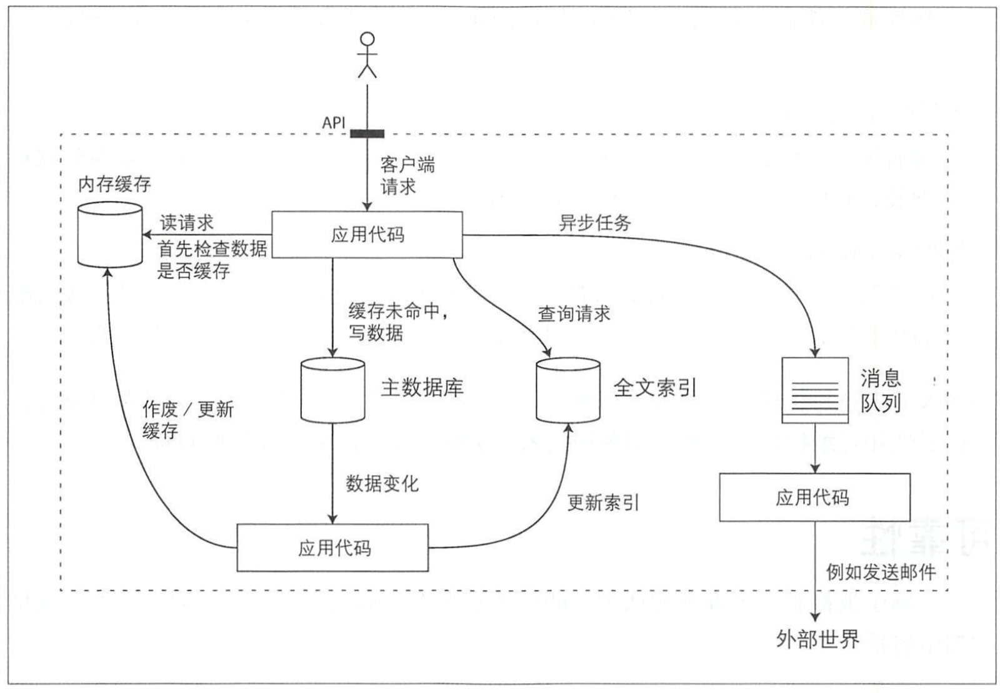
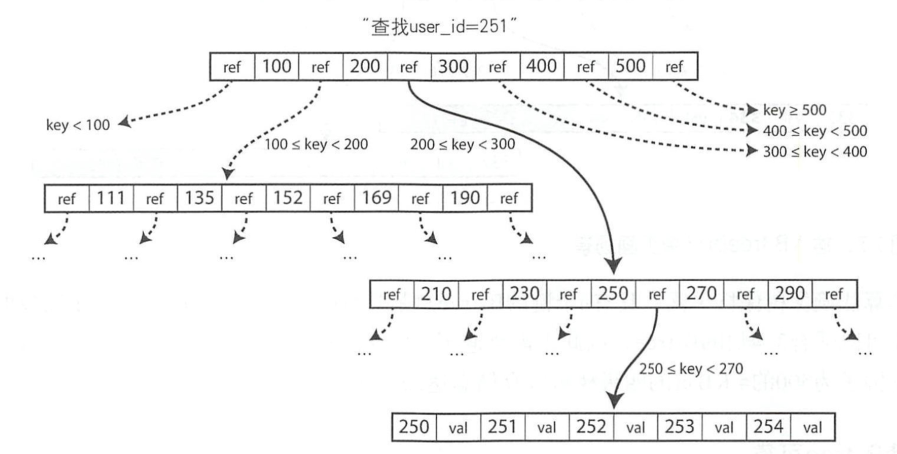
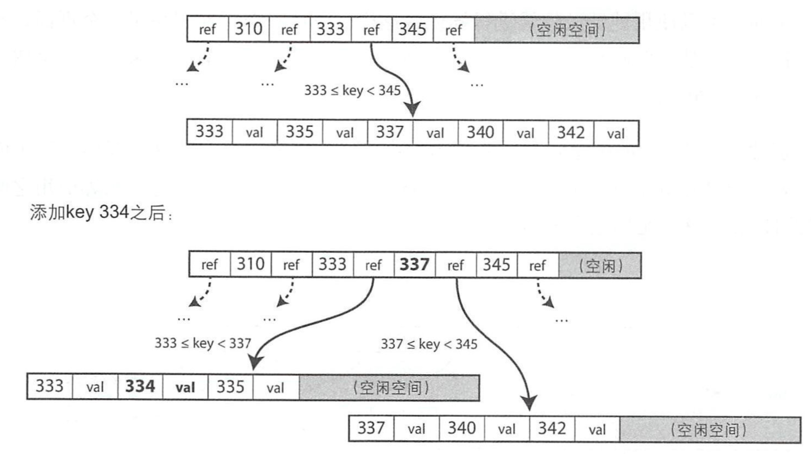

# 数据密集型应用系统设计读书笔记

## 可靠，可扩展与可维护的应用系统 

### 名词解释 

* 可靠性：  容忍硬件/软件失效，人为错误
* 可扩展性：  评测负载与性能，延迟百分位数，吞吐量
* 可维护性：  可运维、简单、可演化性
* 扇出  从电子工程中借用的一个术语，它描述了输入的逻辑门连接到另一个输出门的数量。输出需要提供足够的电流来驱动所有连接的输入。在事务处理系统中，用来描述为了服务一个输入请求而需要做的请求总数。

### 一种通用系统架构 

### 要点 

* 在批处理系统中，我们通常关心吞吐量\(throughput\)，即每秒可处理的记录条数，或者在某指定数据集上运行作业所需的总时间；而在线性系统中通常更看重服务的响应时间\(response time\)，即客户端从发出请求到接收响应之间的间隔。
* 中位数指标非常适合描述多少用户需要等待多长时间：一半的用户请求的服务时间少于中位数的响应时间，另一半则多于中位数的时间。因此中位数也被称为50百分位数，有时缩写为p50.
* 采用较高的响应时间百分位数\(tail latencies，尾部延时或长尾效应\)很重要，因为它们直接影响用户的总体服务体验。亚马逊注意到，响应时间每增加100ms，销售额就会下降1%，其他研究则表明，1s的延时增加等价于让客户满意度下降16%。

## 数据模型与查询语言 

### 名称解释 

* NoSQL  被解释为“不仅仅是SQL”
* 阻抗失谐  如果数据存储在关系表中，那么应用内存代码的对象与表、行和列的数据库模型之间需要一个笨拙的转换层，模型之间的脱离被称为阻抗失谐。

### 使用NoSQL的驱动因素 

采用NoSQL有这样几个驱动因素：

* 比关系型数据库更好的扩展性需求，包括支持超大数据集或超高写入吞吐量
* 普遍偏爱免费或开源软件而不是商业数据库产品
* 关系模型不能很好地支持一些特定的查询操作
* 对关系模式一些限制性感到沮丧，渴望更具动态和表达力的数据模型

## 数据存储与检索 

### 索引 

索引是基于原始数据派生而来的额外数据结构，很多数据库允许单独设置和删除索引而不会影响数据内容，它只影响数据读取速度。  
 适当的索引可以加快读取查询，但每个索引都会减慢写入速度。

#### 哈希索引 

哈希索引是一种键值对索引，可以直接将key映射到value的偏移量上去，时间复杂度为O\(1\)。  
 哈希表存储在内存，但它映射的文件通常存储在磁盘，常规做法是将文件分段，在写入文件过程中，如果文件达到一定体积则关闭它，并将后续写入到新的文件中。关闭的文件则可以进行压缩，并且可以在压缩过程中合并重复的键和段，重构哈希表，从而极大的节省磁盘空间。  
 对冻结段的压缩和合并可以在后台线程进行，而在进行时，仍然可以用旧的文件提供服务，合并完成后就可以将旧文件删除。  
 因为每个段都有自己的哈希表，查询过程通常为递推模式，即先查询最新的哈希表，如果没有则递推到下一个段。如果键不存在，则会导致查询穿透，通常会使用布隆过滤器解决这个问题。  
 哈希索引的局限性为：

* 哈希表必须全部放入内存，如果有大量的键，会有很大开销。如果将压缩后的哈希放到磁盘，将会有大量的随机I/O操作，性能较差，当哈希变满时，解决冲突也将变得额外麻烦。
* 不支持区间查询，只能采用逐个查找的方式查询每一个键。

#### SSTables 

SSTables是排序字符串表，它要求每个键在每个段文件中只能出现一次（可以通过压缩过程进行筛选和过滤）。  
 SSTables相对于不排序的哈希索引日志文件段，有下面几个好处：

* 使用合并排序算法，可以使合并段更加简单高效
* 在文件中查找指定的值时，不需要把所有键都存在内存中，只需要保存一个稀疏的内存索引即可。

基本工作流程为：

* 当写入时，将其添加到内存中的平衡树结构中，如红黑树。这个内存中的树有时被称为内存表。
* 当内存值大于某个阈值时，将其作为SSTables文件写入磁盘，因为内存中已经排过序，写磁盘可以非常高效。新的SSTables文件作为数据库的最新部分。
* 读取时，采用递推查询，从内存到文件，从新到旧直到找到目标或遍历完成。
* 后台进程周期性的执行合并和压缩，以合并多个段文件并丢弃已经删除或者覆盖的值。
* 为避免崩溃导致的数据丢失，可以维护一个日志，用于崩溃后的修复。

#### LSM-Tree 

SSTables的算法就是LevelDB和RocksDB正在使用的，都是基于Google的Bigtable论文开发的。  
 最初这种索引称为‘日志结构合并树（Log-Structured Merge Tree或LSM-Tree）’，因此基于合并和压缩排序文件原理运行的存储引擎通常都被称为LSM存储引擎。

#### B-tree 

前面的日志结构索引LSM将数据库分解成可变大小的段，通常是几兆字节，并且按序写入。B-tree则是将数据分解成固定大小的块或页，传统上是4K，是磁盘读写的最小单元，因此更接近底层设计。  
 每个页用地址或者位置标识，让一个页可以指向另一个页，类似指针链表，不过这里不是指针地址而是磁盘地址。可以通过这些页面构造一个树状结构，称为B-tree。  
   
 指定某一页为根页，每次查找都从根页开始，类似于平衡树的根。  
 每个页下面包含多个子页的磁盘地址，子页的数量称之为分支因子，分支因素取决于存储页面引用和范围边界所需的空间总量，通常为几百个。

* 更新  更新需要先找到数据所在的子页，然后更新内容后写回磁盘，该页的引用不需要变更，依然有效。
* 添加  先找到新键所在范围的页，然后将内容加入到该页，如果页已经没有足够空间，则会将原页分裂成两个半满页，同时更新父页的引用：    该算法确保树保持平衡，具有n个键的B-tree总是有O\(logn\)的深度，大多数数据库适合3到4层的B-tree，不需要遍历很深的页面层次就可以找到所需页。分支因子为500的4KB页的四级树可以存储256T的数据。

在页分裂时如果写入一半系统崩溃，那么会导致出现孤儿页，从而导致索引破坏，为避免这种情况，通常会在B-tree外添加额外的磁盘数据结构：预写日志（WAL），也称为重做日志。预写日志仅支持追加写入，因此速度很快，它可以在系统崩溃时恢复数据。  
 此外，不同于LSM存储引擎，B-tree是在原地更新业，因此它的并发控制也很复杂。

**B-tree优化方案**

* 一些数据库不直接覆盖页，也不用WAL恢复数据，而是使用写时复制方案：修改的页被写入不同位置，父页创建一个新版本并指向新的位置，这种方案同时有益于并发控制
* 保存键的缩略信息而不是完整信息，可以节省页空间，从而把更多的键压入页中，实现更高的分支因子，进而减少层数。
* 维护树的布局，让相邻叶子节点按顺序保存在磁盘上，通过范围读取实现预加载。但是随着树的增长，维护这个顺序也越来越难。
* 在相邻的兄弟节点之间加入指针链接，可以直接跳到相邻节点不需要回到父节点再次跳转

#### 索引中存储值 

索引的键是搜索查询的对象，而值可以是下面两类：

* 实际的数据行记录，也称为聚集索引  聚集索引可以加快读取速度，但是需要额外的存储并且会增加写入开销。
* 其他地方存储行的引用，也称为堆文件  在原地更新，且更新值大小相同的情况下，堆文件可以很高效，如果更新值大于原始值，则可能需要移动数据，性能就会降低。  从索引到堆文件的跳转也意味着一部分的性能损失。

