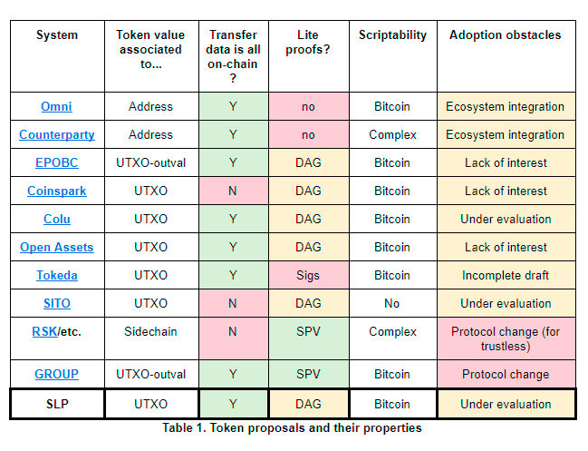
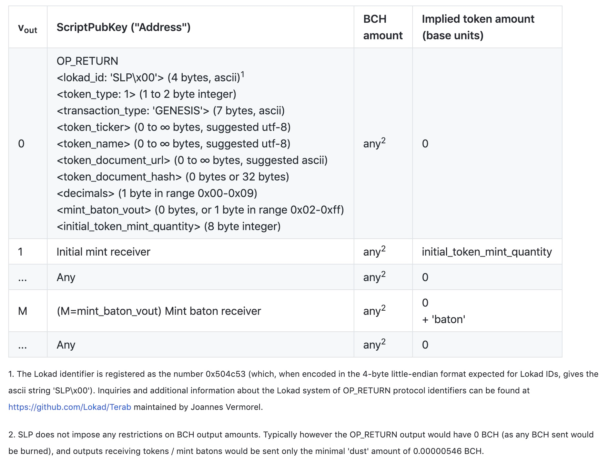
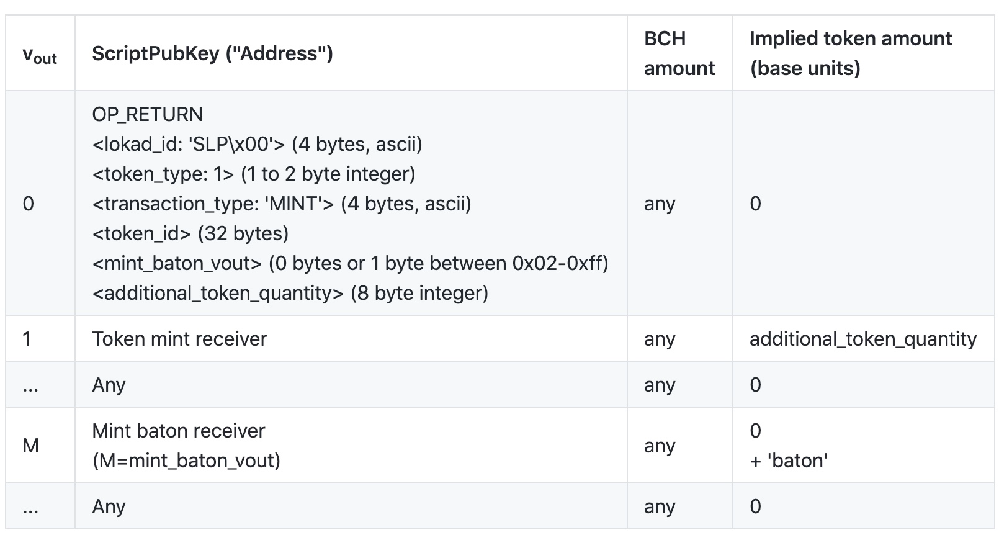
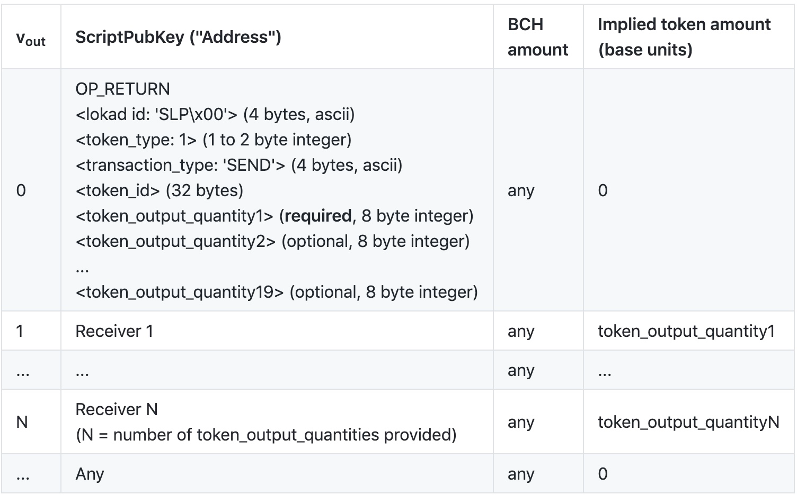
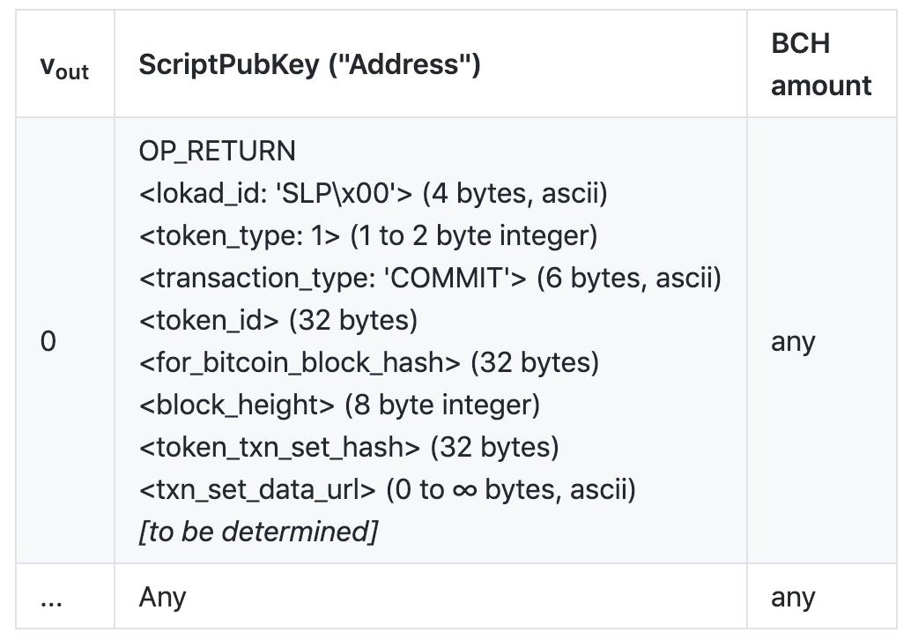

# SLP代币协议

## 声明 

版本号 3.0，发布时间 2018年8月21号

## 章节一：背景 

### 介绍 

BCH需要一个可交易，可赎回的Token系统。就如同以太坊目前存在的无数token以及数十亿美元的代币市值类似。  
 而GROUP以及OP\_GROUP之类的协议没有达到预期的效果，因此在此提出一个新的协议，简单明了，方便实现。

### 概述 

SLP将交易中的OP\_RETURN和标准交易输出结合起来，实现token的发送和传输。我们在OP\_RETURN中定义一系列简单的协议，token的用户和市场共同遵循即可。  
 由于SLP建立在现有BCH的基础上，因此用户可以通过SPV协议非常轻松的校验交易有效性。

### 特性 

* 不需要许可  代币的发行和转让不需要许可
* 简单  整个系统应该简单明了，易于理解
* 健壮性  需要有容错机制
* 非原生  在BCH协议上进行操作，不能修改BCH协议
* SPV友好  可以使用SPV对交易进行验证
* 可扩展性  系统要有扩展版本的设计
* 技术支持  为生态的发展制定技术标准和支持

### 和其他代币协议的比较 

通常，矿工需要验证交易和token安全协议，但是这样就不可避免的需要改造BCH的基础协议，如GROUP协议等。如果不想修改底层协议，那么我们就需要从原有交易格式中找到可以添加协议的元数据，OP\_RETURN通常是最好的选择。  
 不幸的是，任何拥有BCH的用户都可以在没有持有任何tokne的情况下发送token交易，因此我们还需要在OP\_RETURN中添加校验部分。  
 一些协议使用特殊UTXO来实现发币协议，我们可以称之为染色币，这些染色币有自己的地址格式，并且可以通过UTXO的特性防止双花，但是如果UTXO被使用到不能识别这些染色币的钱包里，就白白浪费了这个UTXO。  
 Omni协议则抛弃了UTXO模型，通过元数据分析构建了一套账户模型，BCH上的USDT就是通过Omni实现的。  
 下面是几种协议的特性：  
   
 

### 设计理念和挑战 

#### 简洁与共识 

我们最重要的准则就是简洁性，因为我们发现很多BTC的协议都过于复杂，并且简单的规则也有利于共识机制。比特币的基础层可以容纳一组复杂的共识规则，因为工作量证明可确保较高的拜占庭容错能力。换句话说，如果矿工的实现方式不被认同，那么会很快被发现与其他矿工节点不兼容，并且非完整性数据也会被清除。

相比之下，元数据未经过矿工验证，有效数据与无效数据之间没有明确的分隔，这导致容错率特别低。对于依赖中央机构或签名者的令牌计划，这不一定是一个问题。但是，对于像SLP这样的无许可系统，减轻此问题的唯一明显方法是保持规则简单明了。

#### 为什么对SPV友好的无许可令牌很困难 

在不修改基本比特币协议的情况下，支持SPV钱包非常具有挑战性。这是因为尽管无效的比特币交易已从区块链中排除，但无效的第二层交易数据如OP\_RETURN，OUTPUT并未被排除。因此，不能使用检查merkle分支的SPV安全技术来确保事务包含在块中。

为了证明token转移是有效的，有必要从token生成开始验证先前所有的转移。如果我们能仅使用先前交易的子集来确定性地验证令牌交易，那么会大大降低计算量。不幸的是，这似乎是不可能的，因为攻击者可以廉价地创建交易链，以欺骗接收者以使其认为传入的交易无效。

我们考虑了使用各种承诺方案来尝试防止这种攻击的可能性，这些方案要求事务指向先前的事务。但是，这种想法是无效的，因为所有链接都可以被欺骗，无论它们指向的是虚假链上的虚假交易还是有效链上的真实交易。因此，犯规行为只会在发散的确切位置（可能在任何地方）被检测到。

#### 混合安全模型 

最后，我们得出结论，最简单的解决方案是最好的：用户可以根据自己的选择验证令牌所有权的转移，并且要理解，如果他们没有完全验证，那么从理论上讲攻击者就有可能创建更长的攻击链。  
 具有部分SPV兼容的验证是可以接受的限制，前提是它提供了基于基础架构的解决方案以提供完整的验证。在下一节中，我们将详细讨论安全模型。

## 协议规定 

### 协议概述 

该协议定义了四种类型的token交易，这些token交易包含在标准比特币现金交易的OP\_RETURN元数据中。  
 前两种token交易类型（生成和扩展铸造）定义和发行token。第三种交易类型是最常见的（发送）；它允许用户转移token。最终交易类型（校验和承诺）是对基本共识模型的补充。  
 像大多数“彩色硬币”协议一样，SLP将token金额与实际BCH交易OutPut相关联，但token金额与OutPut的BCH金额无关。由于比特币交易通常具有多个output，因此OP\_RETURN消息指定将多少token分配给哪些输出。

除了定义OP\_RETURN消息的格式外，协议还定义共识规则，这些规则确定token发送事务或扩展的铸造事务的有效性（请参阅下面的共识规则部分）。

SLP交易可能包含多个输入和输出，这些输入和输出与它们所携带的比特币交易中的输入和输出相对应（尽管在同一交易中可能有其他非SLP输入和输出）。请注意，您不能在同一事务中发送多种类型的SLP令牌。同样，如果不正确地使用包含令牌的输出，则可能会丢失令牌。

### 共识模块 

SLP的共识模型称为`Proof-of-Work/Proof-of-Trust`。

尽管元数据是可修剪的，但它仍然是比特币块的一部分-通过工作量证明在不可变的分类帐中进行了时间戳记和排序。但是，像大多数基于OP\_RETURN的方法一样，SLP认为有效的数据也不会与认为无效的数据区分开。尽管明确规定了防止重复支出的顺序，但是必须根据所有参与者都同意的一组规则来过滤数据。

在许多方面，这与比特币本身的运作方式并无不同。用户必须遵循相同的共识规则集，以维持其网络效应。市场始终是每个规则集拥有多少价值的最终裁判，因此总是存在分歧的可能性。

在纯的工作量证明模型中，拜占庭式容错是通过经济诱因和不兼容的设计数据集来实现的。相比之下，SLP依靠覆盖PoW骨干网支持的一组简约规则。

底层的比特币现金区块链可以处理交易顺序，用户只需按照惯例使用相同的规则即可。这些规则将由以下方面的一致性来定义：

* 此协议
* 协议实现，如钱包
* 代币发行人

### 校验和承诺 

令牌发行者和/或其他受信任的生态系统参与者应根据本规范发布有效交易的定期哈希承诺，该规范提供了“信任证明”。

重要的是要理解，校验和是整体共识模型的一部分，但本身不是共识规则的一部分。如果这听起来很矛盾，请理解区块链数据和协议规则至关重要。发行人通常（但并非总是）只是最重要的经济参与者。

发行者或受信任的验证者的承诺充当“责任证明”。如果经济利益相关者没有能力根据议定书的规则提供准确的交易摘要，则显而易见，市场力量将做出适当反应。附带的好处是，校验和承诺会为进入市场设置适度的障碍，从而将精力充沛的参与者与更专业的操作区分开来。

### 共识规则 

所有SLP交易需遵循下面规则：

* 第一个输出（vout = 0）中必须有一个OP\_RETURN输出脚本。 OP\_RETURN输出脚本定义为以操作码0x6a开头的ScriptPubKey。
* 该OP\_RETURN第一输出脚本包含一个SLP消息，其内容必须完全符合此规范（请参见“事务详细信息”部分）。

#### 转移交易规则（发送） 

* 指定的令牌输出总和OP\_RETURN不得超过有效token输入的总和。 “有效token输入”是交易输入（即用完的TXO），已知先前的交易符合SLP共识规则。有效token输入的值只是创建TXO的事务的OP\_RETURN SLP消息中列出的token数量。
* 在此计算中将忽略具有不同token\_type或token\_id的输入，即将其视为贡献了0个令牌。

#### 发行交易规则（GENESIS / MINT） 

* GENESIS交易可以自我验证有效或无效，不依赖于输入的有效性或内容。
* MINT需要特殊的“baton”输入，可以直接从创建它的GENESIS中输入，也可以通过先前的MINT间接输入。在此计算中将忽略具有不同token\_type或token\_id的输入，即将其视为没有贡献任何baton。令牌输入也应该被忽略-只有baton才有意义。

#### 其他考量 

A. 原则上，一个事务可以包含多个OP\_RETURN输出脚本（当前这些脚本在比特币中是非标准的，但是可能会改变）。我们强调vout = 0之后的所有其他输出脚本均与SLP不相关。因此，辅助OP\_RETURN脚本可以例如用于保存注释或其他协议的数据。  
 B. 令牌输出的数量可能与交易输出的数量不匹配，但这不会使交易无效：

* 如果交易output的数量大于OP\_RETURN中指定的token的数量，则额外的交易ouput隐式接收0个令牌。
* 如果交易output的数量小于OP\_RETURN中指定的token数量，则多余的token将被销毁。 （请注意，这些销毁token量否包含在令牌输出总和检查中）

C. 交易的一个或多个输入可能来自无效或伪造的SLP交易；这不会使交易无效，因为这些输入只会被忽略。只要仅在有效输入的基础上满足共识规则，该交易即有效。  
 D. token的初始化定义了它正在使用的协议类型（token\_type）。相对于“软分叉”，SLP的灵活性要差一些，但是可以防止将来出现问题。尽管是不变的，但我们仍在每个事务中传递版本，以方便解析，并在将来的SLP协议类型中提供无限的灵活性。  
 E. 在发送中，即使所有求和都是64位整数，输入和或输出和仍可能超过2的64次方-1（64位整数限制）。这种溢出的金额是有效的，因此验证器应避免使用在这些条件下溢出的累加器。  
 F. 发送数量为0的token是一种极端情况，不需要验证即有效，比如发币交易。在输出为0的交易中，输入都是有效的。

### 交易详情 

#### 交易格式 

SLP在OP\_RETURN之后使用受限形式的比特币脚本，将可变长度的数据块（字节数组）编码为比特币脚本PUSH操作。在随后的部分中，使用尖括号（例如xyz）表示OP\_RETURN有效负载内每个单独推送的块。违反这些规则的消息应根据SLP共识被判定为完全无效：

* 该脚本必须是有效的比特币脚本。每个字段之前必须有一个有效的比特币脚本数据推送操作码。不允许截断的脚本（按中止结束）。
* OP\_RETURN有效载荷内显示的每个字段必须匹配括号中指示的字节大小和/或值。
* 比特币脚本允许以各种方式推送给定的字节数组，我们在SLP中也允许这样做。例如，以四种不同的方式推送4字节的块（如Lokad ID）是有效的：0x04 \[chunk\]，0x4c 0x04 \[chunk\]，0x4d 0x04 0x00 \[chunk\]或0x4e 0x04 0x00 0x00 0x00 \[chunk\] \]。
* 仅允许操作码0x01至0x4e（在OP\_RETURN之后）。请注意，这意味着并非所有推送操作码都被允许使用-禁止在OP\_RETURN中的任何位置使用空推送操作码0x00（OP\_0）或1字节文字推送操作码0x4f-0x60（OP\_1至OP\_16和OP\_1NEGATE）。例如，即使在普通比特币脚本中，操作码0x58实际上等效于0x01 0x08（按\[0x08\]），但使用0x58在GENESIS交易的1字节小数字段中将数字“ 8”压入也是无效的。出于这个原因，某些标准的比特币脚本反编译器必须平等地对待所有推送操作码，不得用于解析SLP事务。
* 某些字段允许空推送（长度为0的块），但是您不能为此目的使用操作码0x00。而是可以使用0x4c 0x00或0x4d 0x00 0x00或0x4e 0x00 0x00 0x00 0x00。
* 所有整数字段都是无符号的，并且使用big-endian编码，并且必须符合指定的字节大小范围。例如，指示的8字节字段中的数量1000将作为字节数组\[0x00、0x00、0x00、0x00、0x00、0x00、0x03、0xE8\]推送。
* 通过简单地省略推送，省略了可选字段。如果包括可选字段，则还必须包括所有前面的可选字段。
* 禁止外来附属物。有效载荷之后出现的任何意外数据将使事务无效。
* GENESIS OP\_RETURN有效载荷内的字符串字段具有建议的字符编码，但是出于有效性的考虑，并不需要成功地对这些字节数组进行解码。列出了（原则上）无限制长度的字符串字段，上限为“∞”，但是实际上，它们受ScriptPubKey长度限制（在撰写本文时为223个字节）的限制。

我们再次强调指出，信息必须是完整的。例如，如果一个事务有5个输出，而第五个输出只有7个字节而不是8个字节，那么前4个输出将有效地烧写令牌，因为整个事务都是无效的。

#### 代币创世交易 

这是定义token的属性、元数据和初始数量的第一笔交易。此后，token由token生成交易哈希值唯一标识，这称为token\_id。

token\_type表示SLP子协议：

* 1-Permissionless Token Type
* 2-Reserved for Security Token Type \(see Appendix A\)
* 3-Reserved for Voting Token Type
* 4-Reserved for Ticketing Token Type
* ...

本文档仅指定Permissionless Token Type（1）的规则和操作。不同类型的token规则不能混合使用，因此其他token类型的未来规范不会影响类型1的共识有效性。

`mint_baton_vout`：如果创世赋予特定交易输出带有“mint\_baton\_vout”的特定交易输出，则可以增加将来的token供应，“mint\_baton\_vout”可以传递并用于将来的铸币（使用“ MINT”交易，请参见下文）。如果不存在mint\_baton\_vout或引用的输出不存在，则说明该baton不存在，并且token可证明具有一次性发行。

`decimals`：表示1个令牌可分为10 ^decimals位基本单位。 SLP消息存储指示以基本单位衡量的token数量的整数，类似于比特币交易如何存储以基本单位“ satoshis”衡量的BCH数量。例如，对于在创世中指示的带有小数点后六位的token FOO，数量12.53 FOO（如在钱包软件中显示）将由12530000个基本单位（8个字节，十六进制0000000000bf3150）表示。小数点后的8将提供与比特币相同的除数，而小数点后的0将提供不可分割的token。

创世交易还包括放置在第二个交易输出（vout = 1）上的initial\_token\_mint\_quantity事件，定义了初始发行量。

**交易输入**

交易的input没有限制

**交易输出**

#### 挖矿交易 

挖矿交易即使用baton增加代币发行量。  
 可以通过在挖矿交易中花费`minting batcon`格式的UTXO来增加代币发行量，这种交易类型为`additional_token_quantity`，此外，挖矿权限是可以转移的，如果挖矿权限转移到新的owner，那么就可以由创世地址外的其他地址来增发代币。

与GENESIS一样，MINT允许终止baton，或进一步将baton传递给以后的造币业务：如果mint\_baton\_vout为空或引用的vout不存在，则交易有效，但baton会丢失。即使在几次铸造事件之后，这也可以证明令牌的铸造终结能力（不可能复制此baton，因为这将需要双花与该baton关联的交易输出）。

**交易输入**

有“batcon”输入的input（请参见共识规则）

**交易输出**

#### 发送交易 

以下交易格式用于将代币从一个或多个UTXO转移到新的UTXO上。未使用的和代币相关联的UTXO将在交易输入中使用，就像附加到这些UTXO的BCH一样，在区块链接受该交易后，将被视为已全部用完。如OP\_RETURN语句中所示，代币将分配给新的UTXO vout = 1至vout = 19。允许任何数量的其他仅BCH输出。仅BCH的输出可以在代币输出之前出现，但是必须为此输出指定代币数量0。

**交易输入**

任何数量的输入或输入的内容，按任何顺序排列，但必须包括来自匹配token\_id，token\_type的有效代币交易的足够代币（请参阅共识规则）。

**交易输出**

#### 校验和承诺交易 

如前所述，令牌发行者应定期承诺为此令牌进行的先前交易的SHA-256哈希。尽管这不是共识规则的一部分（承诺可能发生在代币交易图表之外，并且承诺数据从未在共识规则中使用），但它允许用户验证发行者是否正确遵守了代币的共识规则。这增加了在兑换时将令牌按预期判断的信心。

最初的实现将集中在支持基于共识的形式的验证上，因此，此时未指定承诺文档的确切格式。总体思路是：

* 提交的信息将仅涉及区块链中存在的交易，该交易导致并包含哈希为for\_bitcoin\_block\_hash的区块。 （如果该块是孤立的，则用户应忽略此承诺。）此块的链高将存储在整数block\_height中（即使这是多余的，它也有助于查找轻钱包）。
* 提交的SLP信息集将使用有序merkle树（例如merklix）进行哈希处理，该树使精简版客户端可以获得给定SLP项的存在或不存在的简短merkle证明（存在表示有效，缺少表示无效）。
* 这些承诺将因此使基于检查点的验证成为可能，稍后将进行讨论。从该集合中，还可以审核该块的流通令牌总数（已发行令牌减去已燃烧令牌）。
* 设置的项目将与一个特定的token\_id相关，并且可能是交易或交易输出；全部或仅未花费。该套件将经过精心选择，以最小的尺寸满足上述要求。

**交易输入**

至少一个输入应使用受信任的验证程序（可以是原始发行者，或令牌社区中受尊敬的成员）控制的地址，并且此输入的签名数据应包括OP\_RETURN输出。

**交易输出**

## 代币地址格式 

该协议的共识规则，安全性模型和操作独立于任何特定的地址编码；从理论上讲，它可以与旧地址或CashAddr地址一起使用。

但是，使用新的地址格式很有意义，因为它将大大减轻可用性问题。具体来说，这将有助于防止用户意外花费具有令牌余额的UTXO，如果用户将令牌发送到不支持令牌的钱包，则很可能会发生这种情况。

### SLP地址 

按照CashAddr的设计和术语，SLP Addr将使用相同的编码方案，但其前缀除外-用“ simpleledger：”代替“ bitcoincash：”。此项目已采用URI前缀“ simpleledger”。由于前缀是校验和的一部分（即使在显示中省略了），因此对于需要Cash Addr地址的应用程序，SLP Addr将是无效的编码，反之亦然。普通的比特币现金钱包和SLP钱包之间的暂时不兼容可以通过提供地址转换器的SLP钱包来解决。这是达成所需分离的可接受折衷方案。

分层确定性钱包可用于令牌。为了使地址与可能使用相同助记符种子生成的地址分开，SLP钱包可以使用不同的派生路径，新的BIP39 coin\_type整数……或用于非BIP39的钱包（例如Electron Cash），bip32的盐值不同基于PBKDF2密钥扩展。

但是，钱包也可以选择简单地期望用户拥有与普通BCH资金不同的代币钱包文件。

