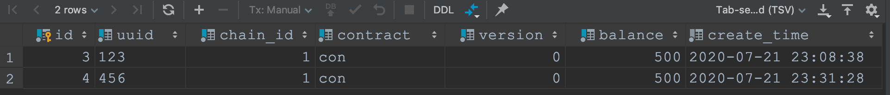

# MySQL事务问题验证

我们使用项目中一个余额表来验证：

## 查询事务隔离级别 

执行下面SQL（MySQL8.0以下版本transaction\_isolation为tx\_isolation）查询隔离级别为可重复读：

## goland开启事务单步模式 

在goland中连接数据库，通过下面命令创建多个连接：  
   
 设定连接的事务执行方式为手动：  
 

## 脏读 

**脏读是指某个事务完成部分写入，但是还未提交，此时如果其他事务可以看到此事务已写入的数据，那么就是脏读。**  
 数据库初始为空。  
 创建事务A和B，并按照从上到下，从左到右的执行顺序执行事务：  
   
 通过执行结果可知，当前事务可以防止脏读，不会读到其他事务的修改，而是读到旧的快照数据。  
 **注意**，这里当事务B提交后A依然看不到B提交的数据，如果是`读-提交`，那么A可以看到B提交数据。

## 脏写 

**当一个事务写入数据的时候覆盖了其他未成功提交事务的写入数据时，就是脏写。**  
 数据库初始状态为：  
   
 事务AB按照自上而下顺序执行：  
   
 通过执行得知，当前事务可以防止脏写，因为当数据库写同一个数据时是互斥的，未获取到锁的事务会等待已获取锁的事务完成后再执行。  
 事务A

事务B

## 读倾斜 

当前数据库状态：  
   
 我们先使用`读-提交`级别复现读倾斜问题：  
   
 然后使用`可重复读`再次执行此SQL：  
   
 由此可见，可重复读可以避免读倾斜问题。  
 事务A：

事务B：

## 一致性快照事务的可见性规则 

* 每笔事务开始时，数据库列出其他正在进行的事务，然后忽略这些事务完成的部分写入，即不可见。
* 所有中止事务所做的修改全部不可见。
* 较晚事务ID（晚于当前事务ID）所做的所有修改不可见，不管这些事务是否完成了提交。
* 除上面三条外，其他所有的写入都对应用查询可见。

上面读倾斜的例子已经验证了上面三条描述。注意，一致性快照可见性原则适用于读取数据，如果对数据对象做修改，那么将是另一种情况了。

## 更新丢失 

**更新丢失是指当两个事务在同一个对象上做修改时，由于隔离性，第二个提交的事务并不包括第一个事务修改的数据部分，从而覆盖掉了第一个事务的写入，造成数据丢失。**  
 比如下面事务B的余额设置覆盖了事务A设置的300余额，改成了400，造成了更新丢失。这种情况大多由于应用层去计算余额导致的，我们使用下面的`原子写操作`即可避免。  
   
 事务A

事务B

## 原子写操作 

**原子写操作是指直接用SQL更新数据，而不需要读出数据后手动计算，可以解决递增计数器等问题**  
 比如更新丢失例子里的version没有丢失更新，就是因为用了原子写操作。

## 原子比较和设置 

原子比较和设置可以防止更新丢失：  
   
 可以看到，事务B的更新并未生效，即使在事务B中看到的version为0，但是当执行更新时依旧会失败。  
 事务A：

事务B：

## 显示加锁 

使用FOR UPDATE可以为数据行显示加锁，如下面的两个事务，在事务A提交后，事务B以FOR UPDATE的方式读取数据则能读到最新的，如果不以for update的方式读取则是快照数据。  
 这里难以理解的地方在于事务B的for update和非for update读取数据不一致的问题，可以这样理解，事务在开始时并未创建MVCC的快照，只有当开启查询语句时才去创建快照，如果一开始使用不带锁的查询，那么就会获得一个事务A还未提交的快照，后续所有不带锁的查询都是从这个快照拿数据，不会去更新这个快照，也就符合可重复读的含义。带锁查询则会去读取最新快照，如果我们在事务B中删除第5行，直接用带锁查询作为第一条SQL，那么后面的所有读取都会是事务A结束后的300，因为事务B在此时会等待事务A结束再去创建快照。  
   
 事务A：

事务B：

## 写倾斜和幻读 

**如果更新的是不同对象，则是写倾斜**  
 **这种在一个事务中的写入，影响另一个事务查询结果的现象，称为幻读**  
 下面例子中，我们需要123和456两个用户的总额度大于800才能进行转账，在两个事务同时开始时，读到的都是快照，因此总余额都是1000，即便事务A提交后，事务B总余额仍为1000，因此两个事务都执行成功，最后数据库只有400的余额，不符合应用层的设定，这种就是写倾斜。我们可以通过显式加锁来解决幻读问题，从而就解决了写倾斜。也可以用version做原子比较和设置，同样可以解决此问题。  
   
 事务A：

事务B：

