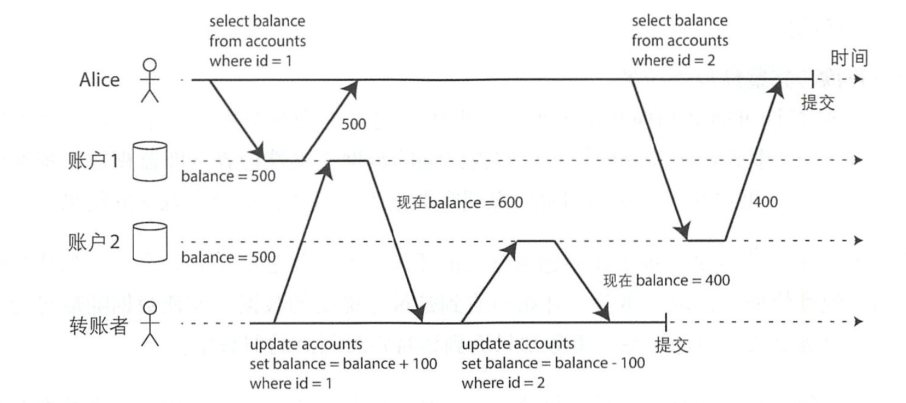
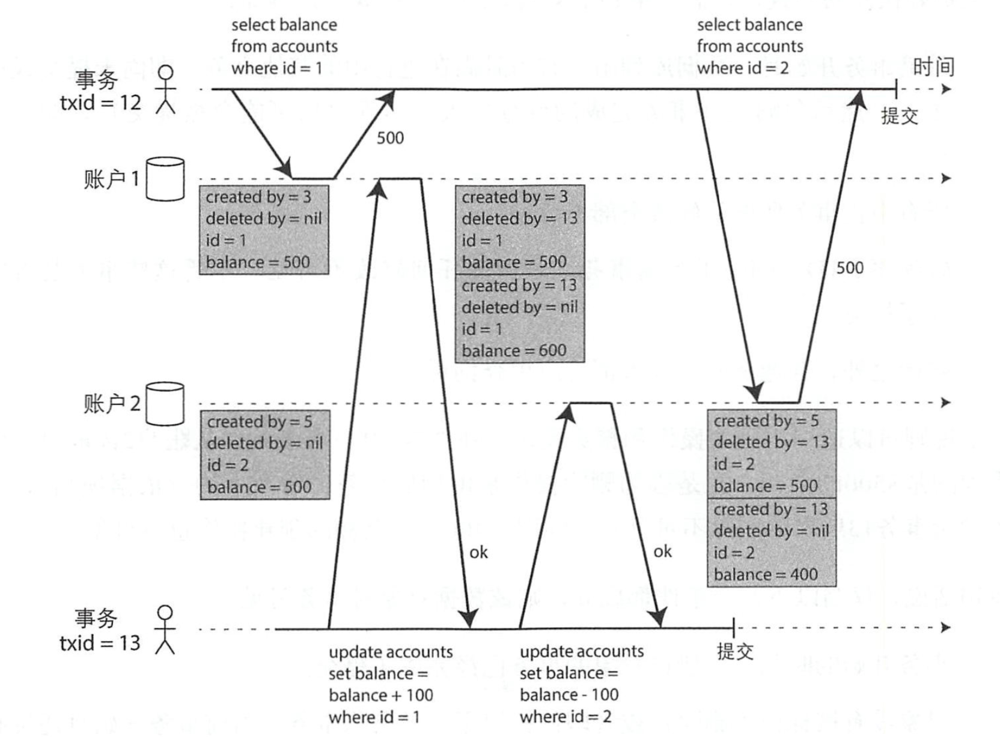
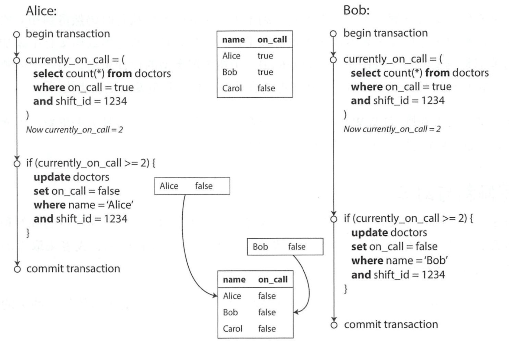

# 深入理解事务

## 事务解决的问题 

在一个苛刻的疏浚存储环境中，会有很多可能出错的情况：

* 数据库软件或硬件可能随时失效
* 应用程序可能随时崩溃
* 应用程序和数据库节点间的连接可能随时会中断
* 多个客户端可能同时写入数据，造成数据覆盖
* 客户端可能读到一些无意义的，部分更新的数据
* 客户端由于边界竞争所引入的各种奇怪问题

近十年来，事务一直是解决上述问题的首选方案，事务将应用程序的多个读写操作绑定为一个操作单元，整体要么成功，要么失败，并且在失败后可以安全的重试，从而简化应用层的操作，不必进行各种复杂的错误处理。

## ACID 

ACID即：

* 原子性 Atomicity
* 一致性 Consistency
* 隔离性 Isolation
* 持久性 Durability

各家数据库所实现的ACID不尽相同，仅围绕隔离性就有很多含糊不清的争议，当一个数据库声称支持ACID时并无法准确判断其实现含义，因此现在的ACID宣传更像一种市场营销手段。  
 不符合ACID的系统有时被称为BASE，它比ACID更加模棱两可，几乎没有承诺任何东西：

* 基本可用性 Basically Available
* 软状态 Soft state
* 最终一致性 Eventual consistency

### 原子性 

`出错时中止事务，并将部分完成的写入全部丢掉`。  
 原子性描述了客户端发起一个包含多个写操作请求时可以避免的异常情况，如系统异常，进程崩溃，网络中断等造成数据只写入一半的场景下，原子性可以保证中断事务并丢弃那些局部修改的数据。

### 一致性 

`一致性主要指数据库处于应用程序所期待的预期状态`。  
 一致性的本质是要求应用层维护状态一致，或者说恒等性。应用层有责任正确的定义事务来保证一致性，数据库层面则很难保证。  
 因此不同于隔离性，持久性等数据库特征，一致性更多是应用层的属性，应用层应借助隔离性，原子性以达到一致性，严格来说，字母C并不属于ACID。

### 隔离性 

`隔离性意味着并发执行的多个事务相互隔离，它们不能相互交叉`  
 经典的数据库教材把隔离性定义为可串行化，表示可以假装它是数据库上执行的唯一事务，虽然可以多个事务并发执行，但数据库要保证这多个事务提交时，它的表现结果要和一个一个执行事务完全相同。

### 持久性 

`持久性保证事务一旦提交成功，即使存在硬件故障或数据库崩溃，事务所写入的任何数据也不会丢失`

## 弱隔离级别 

我们上面讲到隔离性在表现上等同于串行化，但是在实际实现时因为性能问题很少会选择真正的串行化。数据库通常会通过弱隔离级别来实现隔离性。  
 隔离是假装没有发生并发，让程序员的生活更轻松，但是隔离的实现并非想象的那么简单，弱隔离级别也会引发各种意想不到的错误。因此对存在的并发问题有深入详细的认识，并知道如何防范才能构建出正确可靠的应用。

### 读-提交 

读-提交是最基本的隔离级别，它只提供两个保证：

* 读数据库时，只能看到已经成功提交的数据，防止`脏读`  `脏读是指某个事务完成部分写入，但是还未提交，此时如果其他事务可以看到此事务已写入的数据，那么就是脏读。`  防止脏读意味着任何写入只有在事务成功提交后，才能被其他事务所见。
* 写数据库时，只会覆盖已经成功提交的数据，防止`脏写`  `当一个事务写入数据的时候覆盖了其他未成功提交事务的写入数据时，就是脏写。`  读-提交可以防止脏写，通常的实现逻辑是推迟第二个写请求，直到前面的写事务完成。  防止脏写可以避免多个事务并发导致的写覆盖冲突，但是不能解决更新丢失问题。即安全更新计数器问题。

#### 读-提交实现方式 

读-提交非常流行，它是Oracle，PostgreSQL，SQLServer 2012，MemSQL的默认隔离级别。  
 数据库通常使用行级锁来防止脏写：  
 当事务需要修改某个对象时，它必须先得到这个对象的锁，直到事务完成，这种锁定由数据库自动完成。  
 防止脏读也可以通过锁来完成，例如读写锁，但是锁会严重降低读取性能，因此大部分的数据库都会为数据维护旧值和当前锁持有事务将要设置的值两个版本，事务提交前，读取全部用旧值，只有事务成功提交后才会切换到新值。

### 快照隔离级别与可重复读 

读-提交实现了防止脏读和防止脏写，可以胜任大部分场景下的数据操作，但是它不能解决`读倾斜`问题。  
   
 上图中，Alice读取账户1时余额为500，当下面事务提交后读取账户2余额为400，在Alice看来她的总账户少了100，如果Alice再次读取账户1就能得到600，不会丢失金钱，但是读取动作并不能封装成一个事务，第一次读和第二次读都符合`读-已提交`的语义。  
 这里主要是一个时间异常，这种时间异常通常被称为`不可重复读`或者`读倾斜`。  
 上面的单个例子并不算致命问题，用户只需再次读取就能解决问题。但是某些备份场景以及分析查询或者完整性查询场景就会导致BUG。  
 快照级别隔离是解决上面问题的主要手段。总体想法是，每个事务都从数据库的一致性快照中读取，事务一开始看到的是最近提交的数据，即使数据随后被另一个事务修改，但保证每个事务都只能看到该特定时间点的旧数据。  
 快照级别隔离非常流行，在PostgreSQL，MySQL的InNoDB，Oracle，SQLServer等主流数据上都有支持。

#### 快照级别隔离实现 

> 我们这里之所以称这种隔离级别为`快照级别隔离`而不是`可重复读`，主要是因为各家数据库对此隔离级别的不同命名。  
>  在Oracle中将之称为可串行化，PostgreSQL和MySQL则称为可重复读。而IBM DB2中的‘可重复读’隔离实际上却是`可串行化隔离级别`，因此在此统一称为快照级别隔离。

和读-已提交类似，防止脏写也是通过锁来实现的。但是读则不需要加锁，快照级别隔离在读写之间不会有任何并发竞争问题。  
 不同于读-已提交的单个备份模式，快照隔离级别会保留多个不同的提交版本，这种技术因此也被称为多版本并发控制（MVC，Multi Version Concurrency Control）。  
 MVCC可以同时实现读-提交和快照级别隔离：典型的做法是，在读-提交级别下，为每一个不同的查询单独创建一个快照；而快照级别隔离则是使用一个快照来运行整个事务。  
 PostgreSQL实现图示：  
 

* 表中每一行都有一个`create_by`字段，包含创建改行的事务ID。
* 表中每行都有一个`delete_by`字段，初始为空，如果事务要删除某行数据，则将`delete_by`设置成事务ID，改行并没有真正从数据库删除，而仅仅是标记为删除。当没有其他事务引用此行时，才会由垃圾回收线程异步删除。
* 更新操作会在内部转换成一笔删除和一笔创建操作：先标记当前行被删除，然后插入新行。此时数据库会同时存在两行。

#### 一致性快照的可见规则 

上面的事务13在执行过程中会出现两行记录，那么应该读取哪个呢？可见性需要遵循下面的规则：

* 每笔事务开始时，数据库列出其他正在进行的事务，然后忽略这些事务完成的部分写入，即不可见。
* 所有中止事务所做的修改全部不可见。
* 较晚事务ID（晚于当前事务ID）所做的所有修改不可见，不管这些事务是否完成了提交。
* 除上面三条外，其他所有的写入都对应用查询可见。

换句话说，仅当以下两个条件都成立，则该数据对事务可见：

* 事务开始的时候，创建该数据对象的事务已经完成了提交
* 对象没有被标记为删除；或者即便标记了，但是删除事务在当前事务开始之前还未完成提交。

根据上面的规则，我们可以避免Alice的读倾斜问题，Alice在事务12第一次读取结果为500，当进行第二次读取时，因为事务13晚于事务12，因此事务13做的修改对12不可见，读到的还是500，就不会凭空少钱。  
 **注意：**这里Alice的两次读取必须在同一个事务中，如果没有显示的开始事务，那么两次读取会被数据库当做两次事务，第二次事务ID会大于13，从而对事务13做的修改可见。

#### 索引与快照级别隔离 

快照级别隔离有如此多的版本，索引应该指向哪个版本呢？  
 PostgreSQL将同一个对象的不同版本放到一个内存页上来避免更新索引。  
 CouchDB，LMDB，MySQL InnoDB则采用另一种方法，它们索引的结构都是B-tree，因此采用了一种`追加/写时复制`的技术：  
 当需要更新时，并不修改现有页面，而是创建一个新的修改副本，拷贝当前必要内容，然后让父节点，或者递归向上直到root节点都指向新创建的节点。每笔写入都会修改当前的B-tree，之后的查询则可以直接作用于特定的B-tree，这样就不需要像PostgreSQL一样去过滤事务ID了，更有利于查询性能，当B-tree不被任何版本引用时再去回收资源。

### 防止更新丢失 

上面讨论的读-提交和快照级别隔离（可重复读），主要解决的是读事务并发。写事务并发除了有可能产生脏写外，还有另一种非常难解决的问题，就是更新丢失。  
 `更新丢失是指当两个事务在同一个对象上做修改时，由于隔离性，第二个提交的事务并不包括第一个事务修改的数据部分，从而覆盖掉了第一个事务的写入，造成数据丢失。`  
 比如下面场景：

* 递增计数器，更新余额  都需要读取当前值，计算新值，然后写回，可能造成其他事务写入被覆盖
* 对复杂对象的一部分进行修改  如对复杂json对象的一部分修改时需要先读取整体数据，修改后写回，可能造成其他事务的写入被覆盖
* 两个用户同时修改一个页面，并尝试将整个页面发送到数据库，类似json的例子

#### 原子写操作 

原子写操作是指直接用SQL更新数据，而不需要读出数据后手动计算，可以解决递增计数器等问题：

MongoDB也支持对json文件的某一部分进行原子操作的语法，包括Redis也提供了对特定数据结构修改的原子操作。  
 原子操作通常采用对读取对象加独占锁的方式来实现，保证在更新提交前其他事务不会读它，这种技术被称为`游标稳定性`。  
 另一种实现方式是强制所有原子操作都在单线程上执行。

#### 显示加锁 

当数据库不支持原子操作，那么可以由应用层显示加锁来解决`读-修改-写入`的操作序列。  
 比如一个多人游戏，几个玩家可以同时移动一个数字，只靠原子操作可能还不够，应用层还需要保证玩家的移动遵守其他规则，就可以显示的加锁：

这种加锁方式通常也被称为`悲观锁`。

#### 自动检测更新丢失 

原子操作和锁都是通过强制`读-修改-写入`操作序列串行执行来防止更新丢失，另一种思路是先让他们并发执行，如果事务管理器检测到更新丢失风险则中止当前事务，并退回到安全的`读-修改-写入`操作序列上去。  
 此方案的有点是数据库可以借助快照级别隔离来高效的检测，PostgreSQL的可重复读，Oracle的可串行化以及SQLServer的快照隔离化都支持此功能，不过MySQL的InnoDB的可重复读不支持自动检测更新丢失。

#### 原子比较和设置 

原子比较和设置是指只要上次读取的数据没有发生变化时才允许更新，这种操作同样可以避免更新丢失：

这种比较方式通常也被称为`乐观锁`。

### `写倾斜`与`幻读` 

请看下面例子：  
   
 Alice和Bob是两名医生，两人在同一时刻点击了调班按钮，他们各自的事务都是从快照读取，因此都会认为此时有两名医生在岗，当事务提交后，却造成没有医生在岗。  
 这种异常情况被称为`写倾斜`，它不是脏写，因为修改的都是各自对象，也不是更新丢失，因为更新都生效了。  
 这里的写冲突并不直接，但是也确实是一种竞争状态：如果将两个事务串行执行，就肯定有一个会失败，但是并行执行就有可能都成功。  
 写倾斜可以视为一种更广义的写冲突问题：

* 如果更新的是同一个对象，则是脏写或更新丢失
* 如果更新的是不同对象，则是写倾斜

对于写倾斜，也可以通过显式加锁来防止：

`FOR UPDATE`会对取回的Bob以及Alice两行加锁，阻止事务并发。不过在mysql上，要谨慎使用显式锁，稍不注意就会引起死锁。  
 写倾斜是一种比较常见的问题，下面场景都会遇到写倾斜：

* 会议室预定  快照级别隔离下，同一个会议室可能被并发的事务同时预定，需要用可串行化的隔离解决
* 多人游戏  两个玩家同时将不同数字移动到同一个位置，可以显式加锁解决
* 声明一个用户名  两个用户同时占用一个用户名，可以通过数据库的唯一性约束解决
* 双重开支  支付服务需要避免额度超支，但是由于写倾斜问题可能有双花问题，可以通过显式加锁解决

#### 为何产生写倾斜 

产生写倾斜的例子都有类似的模式：

* 1.首先通过匹配条件SELECT出目标行
* 2.根据查询结果进行下一步操作
* 3.发起数据库写入并提交事务

上面的操作3会影响操作2的查询结果，因此当多个事务并发时，操作2就不准确了，从而发生写倾斜。  
 `这种在一个事务中的写入，影响另一个事务查询结果的现象，称为幻读。`快照级别的隔离可以解决只读查询下的幻读，但是对于写倾斜却无能为力。

#### 实体化冲突 

上面的会议室预定例子中，还有一个特殊的情况，即会议室本身的记录还未创建，此时如果显式加锁是无法执行成功的，因为没有具体的行给事务加锁。  
 我们可以预先创建一行空数据来实现加锁，这种将幻读问题转换为具体某一行数据锁冲突的方法称为`实体化冲突`。

## 串行化 

弱级别隔离是如此复杂，以至于使用起来很难判断是否安全，如果想简化问题，那么就使用串行化。  
 可串行化隔离通常被认为是最强的隔离级别。它保证即使事务可能会井行执行，但最终的结果与每次一个即串行执行结果相同。  
 目前数据库实现的串行化技术基本是下面三种技术之一：

* 严格按照顺序执行
* 两阶段锁（这几乎是这几十年来唯一可行的方案）
* 乐观并发控制技术，如可串行化的快照隔离

### 实际串行执行 

此方式采用单线程的方法来避免并发，VoltDB/H-Store、 Redis和Datomic等采用此方式。单线程因为避免并发，效率会更高。

#### 采用存储过程封装事务 

应用程序必须提交整个事务代码作为存储过程打包发送到数据库，然后串行执行。存储过程避免了锁开销，同时不需要等待IO，因此吞吐量可以很大。  
 但是存储过程语言繁多，使用困难，代码难以管理以及移植性较差，现在很少使用。

### 两阶段加锁 

2PL（two phase locking）是目前唯一被广泛使用的串行化算法。  
 在2PL中，多个事务可以同时读取同一对象，但是只要出现任何写操作，则必须加锁以独占访问：

* 如果事务A已经读取了某对象，此时事务B想要修改此对象则必须等待事务A完成后才能继续，确保B不会在A的执行过程中修改对象
* 如果事务A已经修改了某对象，那么事务B必须等待A完成才能读取到对象，不会出现读到旧值的情况

2PL不仅在写相同对象之间互斥，读写相同对象也是互斥，因此它3可以防止前面讨论的所有竞争条件，包括更新丢失和写倾斜。

#### 2PL实现 

目前2PL已经用于MySQL的InnoDB和SQL Server的‘可串行化隔离’，以及DB2中的‘可重复读隔离’。  
 实现方式是数据库的每个对象都会有一个读写锁来隔离读写操作，即锁可以处于共享模式或独占模式，基本用法为：

* 如果事务要读取对象，则必须已共享模式获得锁。可以有多个事务同时获得一个对象的共享锁，但如果某个事务获得了对象的独占锁，其他事务则必须等待
* 如果事务要修改对象，必须已独占模式获取锁，不允许多个事务持有该锁
* 如果事务先读取然后修改对象，则必须由共享锁升级为独占锁
* 事务获得锁后，一直持有到事务结束。第一阶段执行前要获得锁，第二阶段事务执行完成释放锁，因此称之为两阶段锁
* 当出现死锁时，数据库会检测到并强制中止其中一个事务，让另一个事务得以继续运行，失败的事务由应用层负责重试

#### 2PL的性能 

2PL的事务吞吐量和查询性能比起其他弱级别隔离差很多，部分原因是锁的获取和释放本身的开销，但是最主要的是降低了事务的并发性。  
 2PL模式下数据库的访问延时有非常大的不确定性，并且死锁的概率比读-提交隔离级别大一些。

### 谓词锁 

谓词锁是用来解决串行化隔离级别下幻读问题的：即一个事务改变了另一个事务的查询结果。  
 如以预定会议室为例，如果事务A查询某个时间段会议室的预定情况，事务B不能插入或更新此时间段内会议室的预定情况。但是它可以修改其他房间预定情况，也可以在不影响事务A查询的情况下修改此会议室其他时间段的预定情况。  
 为了实现这个功能，我们需要引入一个谓词锁，它不属于任何单个对象（比如表的某一行），而是作用于满足查询条件的所有对象：

* 如果事务A想要读取某些满足匹配条件的对象，如使用SELECT 查询，它必须以共享锁模式得查询条件的谓词锁，如果另一个事务正持有查询条件任何一个对象的互斥锁，那么事务A必须等待事务B完成后才能继续运行
* 如果事务A想要插入，修改，删除任何对象，则必须检测所有旧值和新值是否与现有的任何谓词锁匹配，如果事务B匹配，则必须等待事务B完成后才能继续进行

谓词锁可以保护数据库中尚不存在但是可能马上被插入的数据（幻读），2PL和谓词锁配合使用，数据库可以防止任何情况的写倾斜以及其他并发竞争，真正实现隔离串行化。

### 索引区间锁 

如果活跃事务中存在很多锁，那么检测锁是否匹配则非常耗时，基于此原因，谓词锁通常会被退化设计成`索引区间锁`。  
 其实现方式是将谓词锁的保护对象扩大化，也就是说如果谓词锁只命中两行，索引区间锁则可能命中10行。虽然索引区间锁不那么精细，但由于开销低得多，所以是一种常见的折中方案。

## 小结 

* 脏读  客户端读到了其他客户端尚未提交的写人。读-提交以及更强的隔离级别可以防止脏读 。
* 脏写  客户端覆盖了另一个客户端尚未提交的写入。几乎所有的数据库实现都可以防止 脏写。
* 读倾斜\(不可重复读\)  客户在不同的时间点看到了不同值。快照隔离是最用的防范手段， 即事务总是 在某个时间点的一致性快照中读取数据。通常采用多版本井发控制\( MVCC \)来 实现快照隔离。
* 更新丢失  两个客户端同时执行读-修改-写入操作序列，出现了其中 一个覆盖了另一个的写入，但又没有包含对方最新值的情况，最终导致了部分修改数据发生了丢失。快照级别隔离的一些实现可以自动防止这种异常，而另一些则需要手动锁定查询结果\(SELECT FOR UPDATE\)。
* 写倾斜  事务首先查询数据，根据返回的结果而作出某些决定，然后修改数据库 。当事务提交时，支持决定的前提条件已不再成立。只有可串行化的隔离才能防止这种异 常。
* 幻读  事务读取了某些符合查询条件的对象，同时另一个客户端执行写入，改变了先前的查询结果。快照隔离可以防止简单的幻读，但写倾斜情况则需要特殊处理，例如采用区间范围锁。

弱隔离级别可以防止上面的某些异常，但还需要应用开发人员手动处理其他复杂情况\(例如，显式加锁\) 。只有可串行化的隔离可以防止所有这些问题 。我们主要讨论了实现可串行化隔离的三种不同方位:

* 严格串行执行事务  如果每个事务的执行速度非常快，且单个CPU核可以满足事务的吞吐量要求，严格串行执行是一个非常简单有效的方案。
* 两阶段加锁  几十年来，这一直是实现可串行化的标准方式，但还是有很多系统出于性能原因而放弃使用它。
* 可串行化的快照隔离 \(SSI\)  一种最新的算出，可以避免前面方法的大部分缺点 。它秉持乐观预期的原则，允许多个事务并发执行而不互相阻塞；仅当事务尝试提交肘，才检查可能的冲突，如果发现违背了串行化，则某些事务会被中止。

