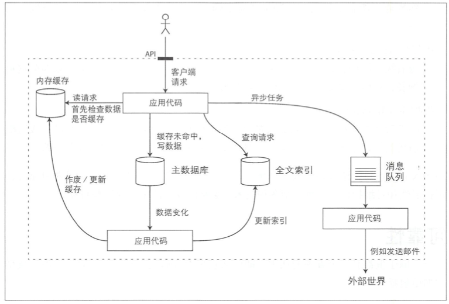

# Redis基本概念

## 缓存中间件 

在现有的系统架构中，我们通常会使用到下面的架构：  
   
 架构中引入了缓存中间件作为应用代码和数据库之间的过滤层，可以有效避免请求全部落到DB引起的性能问题。  
 目前常用的缓存中间件主要有MemoryCache和Redis，前者完全基于内存，支持的数据格式较少，是一个更轻量级的缓存中间件，适用于小型单机项目，后者则需要部署redis服务，支持更多的数据类型，应用范围更广。

## Redis介绍 

Redis 是一个开源（BSD许可）的，内存中的数据结构存储系统，它可以用作数据库、缓存和消息中间件。 它支持多种类型的数据结构，如 字符串（strings）， 散列（hashes）， 列表（lists）， 集合（sets）， 有序集合（sorted sets） 与范围查询， bitmaps， hyperloglogs 和 地理空间（geospatial） 索引半径查询。 Redis 内置了 复制（replication），LUA脚本（Lua scripting）， LRU驱动事件（LRU eviction），事务（transactions） 和不同级别的 磁盘持久化（persistence）， 并通过 Redis哨兵（Sentinel）和自动 分区（Cluster）提供高可用性（high availability）。

## Redis的单线程设计 

在Redis4.0之前，Redis一直使用的是单线程设计，在4.0之后，虽然加入了多线程，但是也只是为主线程操作之外，加入一些异步处理如删除大键，异步刷新，异步备份等，其单线程的本质并没有变。  
 Redis是一个内存数据库，其所有操作都是在内存完成，因此并没有IO的开销，对CPU的依赖也不强，其主要瓶颈在于网络请求。  
 多线程设计可以充分利用计算机CPU进行性能提升，如多核情况下多线程可以实现完美并发。但是因为Redis的操作瓶颈并不在于CPU，因此多线程对Redis的提升并不会特别明显，反而因为多线程的引入，需要处理繁复的并发问题，并且线程切换也会消耗一定性能，因此Redis的主服务一直是单线程设计。  
 单线程的设计不仅使Redis更好的维护和开发，同时天然支持并发写入，因为并发请求在Redis端都是串行操作，不会有竞争问题。

## Redis的多路复用机制 

Redis虽说是单线程设计，但并不表示Redis只能处理一个连接，它使用了多路复用技术可以同时支持大量连接并发请求，注意，这里只是请求并发，处理还是串行的。  
 Redis实现了多个多路复用的函数，并且会优先选择时间复杂度为 𝑂\(1\) 的 I/O 多路复用函数作为底层实现，包括 Solaries 10 中的 evport、Linux 中的 epoll 和 macOS/FreeBSD 中的 kqueue，上述的这些函数都使用了内核内部的结构，并且能够服务几十万的文件描述符。  
 但是如果当前编译环境没有上述函数，就会选择 select 作为备选方案，由于其在使用时会扫描全部监听的描述符，所以其时间复杂度较差 𝑂\(𝑛\)，并且只能同时服务 1024 个文件描述符，所以一般并不会以 select 作为第一方案使用。

## Redis数据结构 

Redis支持5种数据结构：

* [字符串string](http://redisdoc.com/string/index.html)  字符串类型是Redis最基本的类型，它和MemoryCache的类型是一致的。  通常使用SET，GET命令操作，可以设置最大512M的value。  特别注意的是，Redis的原子递增操作就是通过string类型完成的，会将字符串类型解析成整形，然后加一，再转成字符串类型存储。
* [散列hashes](http://redisdoc.com/hash/index.html)  Redis的哈希实现是拉链法，是一个两层的数据结构，上面是数组，下面是链表。使用起来和golang的map没有区别。
* [列表lists](http://redisdoc.com/list/index.html)  Redis的列表是基于双向链表实现的，而不是数组，因此当对列表进行PUSH，POP操作时，和列表体积无关，一直是O\(1\)的操作，同理，访问一个元素需要查链表，不能像数组一样通过下标快速定位。  lists可以实现阻塞操，可以当做消息队列使用。
* [集合set](http://redisdoc.com/set/index.html)  set是string的无序集合。它不允许重复，因此可以检测一个特定元素是否存在。set可以用来取交集，并集，差集以及取随机元素。  set的实现依赖于hashes，所有的value指向同一个对象。
* [有序集合sorted sets](http://redisdoc.com/sorted_set/index.html)  有序集合是在set的基础上加入了排序功能，并且提供了一个可配置权重，其底层实现更为复杂，用到两个数据结构，一个是哈希，一个是条约列表。

## 参考资料 

[通俗易懂的Redis数据结构基础教程](https://juejin.im/post/5b53ee7e5188251aaa2d2e16)  
 [Redis 命令参考](http://redisdoc.com/index.html)

