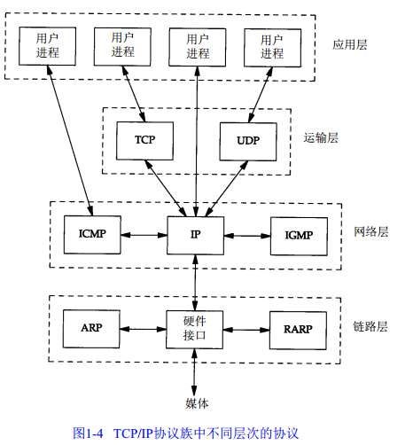

# socket通信机制浅析-前言

socket通信机制浅析-前言

代码获取：[https://github.com/eager7/socket\_demo](https://github.com/eager7/socket_demo)

平常用Socket也就是那几种使用方式，没有梳理过，今天梳理一下这方面的知识。

Socket通信按协议分成TCP和UDP，按域可分成INET和UNIX。

按通信方式又可以分成阻塞和非阻塞，按角色又能分成服务器和客户端，所以其中牵扯的知识面还是很广的。

1. 理论知识

关于编程的知识在网上一搜可以搜出很多，但是其中有一大部分是错误的，或者说有问题的，没有理解代码只是黏贴复制，所以我们前面用一部分时间看一下基础的协议知识，这些知识在《TCP/IP协议详解》中都用描述。

先贴一张TCP/IP协议的图解，对照理解：

1.1 UDP

UDP的数据报格式如下：

从图1-4我们也可以看出来，UDP负责把应用程序的数据通过IP层传出去，但是它不提供可靠性，也就是说它只管发，不管到不到达。

IP首部是UDP的数据报传到IP后添加的，下面是IP首部的内容，其中包括了源地址和目的地址，这个为我们实现发现协议提供了基础。

UDP的首部中放了端口号和数据的一些信息：

端口号是两个分开，意味着可以在服务器和客户端使用不同的端口号。UDP长度字段是指UDP首部和UDP数据的长度，即整个UDP数据报的长度，它最小可以为8个字节，表示可以没有数据。UDP的数据报长度是可以在应用层设置的，TI的WIFI简易连接协议就是通过这个长度进行编码的。

使用UDP很容易导致IP分片，在一个以太网上，链路层数据帧的最大长度为1500字节，其中1472留给了数据，分片很容易导致IP层数据丢失，并且分片因为需要拼包，速率也可能降低，所以要尽量避免分片。当然，这部分在进行Socket编程时不需要考虑，因为IP层负责拼包，在传输层是看不到这个过程的。

分片需要设置IP的首部，如果在一个网络中IP首部设了不分片，但是到了另一个网络因为MTU小于前一个网络而必须分片时就会发生ICMP的错误，所以编程时需要考虑应用场景。这个机制也可以用来查询网络最小MTU的值。

1.2 多播和广播

广播和多播仅用于UDP，所以UDP大多数用来做发现协议，通信协议里直接用TCP即可。

广播的地址分成四种：

一种是受限的广播地址：255.255.255.255只会在本地网络中使用。

一种是指向网络的广播：主机号全为1的广播，A类广播地址为netid.255.255.255，其中netid为A类网络的网络号。

一种是指向子网的广播：主机号全为1且有特定子网的地址，且需要和子网掩码共同作用。

一种是指向所有网络的广播：需要和子网掩码配合，子网号和主机号全为1的地址。

多播又称组播，地址从224.0.0.0到239.255.255.255，其中一些作为知名地址，其他人不能使用

224.0.0.0---224.0.0.255为预留的组播地址，不能使用

224.0.1.0---224.0.1.255是公共组播地址，用于Internet

224.0.2.0---238.255.255.255是用户可用的组播地址，全网有效

239.0.0.0---239.255.255.255是本地组播地址，我们可以使用

广播和多播都可以用来做发现协议，但是目前的情况看来**局域网内的发现协议广播表现比多播要好**，因为多播过于依赖路由器的转发机制，这个机制各家实现的情况还不统一，可能会有未知问题导入。

1.3 TCP

TCP和UDP都在传输层，但是TCP提供一种可靠的，面向连接的服务，意味着两个TCP服务在通信前必须建立一个连接。

在通信时，UDP将保持用户层下发的数据报长度不变，直接给IP层，所以我们说需要自行控制长度，避免分片，但是TCP不同，TCP会将应用层的数据分割成TCP认为合适的长度，然后传给IP，每发一个数据块，就会启动定时器等待，如果超时就重发这个数据块。

TCP的首部远比UDP的首部复杂，其中也包括源端口号和目的端口号，加上IP的地址就可以确定一个地址。

2. 实践编程

见另外几篇文章。

